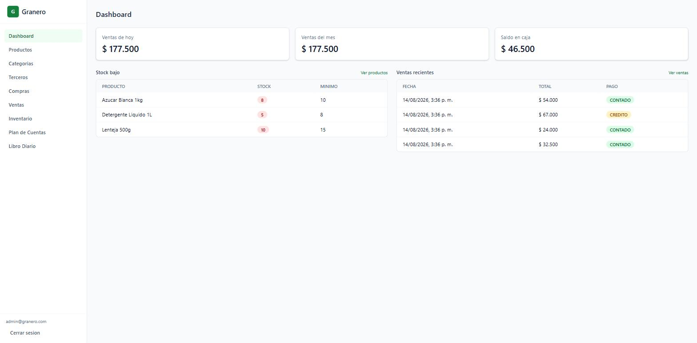
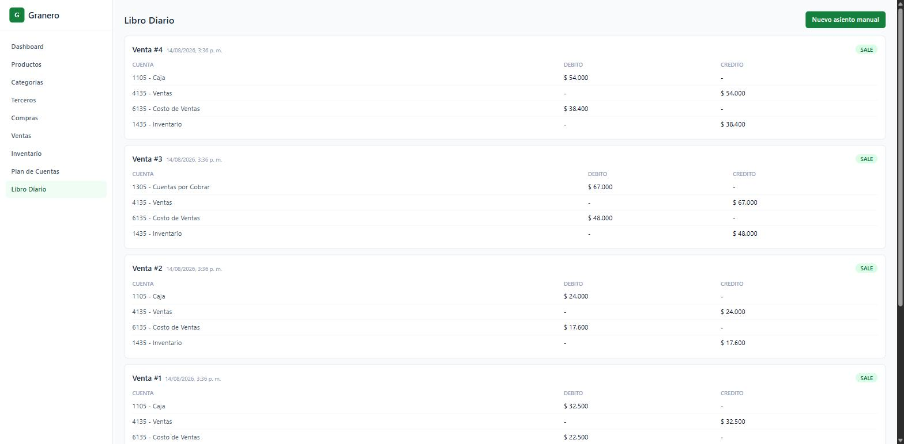

# Granero — Administración de tienda/granero

Aplicación de gestión de inventario, ventas/compras y contabilidad básica para una tienda o granero, construida como pieza de portafolio con capas de **clean architecture** simples (dominio / aplicación / infraestructura / presentación).




## Funcionalidad

- **Inventario**: productos, categorías, kardex de movimientos, ajustes de stock, alertas de stock bajo.
- **Terceros**: clientes y proveedores unificados en una sola entidad con tipo (`CLIENTE`, `PROVEEDOR`, `AMBOS`).
- **Compras y ventas**: registro con múltiples items, que automáticamente actualizan el stock y generan el asiento contable correspondiente en la misma transacción.
- **Contabilidad de partida doble**: plan de cuentas, libro diario, asientos manuales (ingresos/gastos de caja), con validación de que todo asiento esté balanceado (débitos = créditos) antes de persistirse.
- **Dashboard**: ventas de hoy/mes, saldo en caja, alertas de stock bajo, actividad reciente.
- **Autenticación**: login simple con JWT.

## Stack

| Capa | Tecnología |
|---|---|
| Backend | Python + FastAPI + SQLAlchemy + Alembic + PostgreSQL |
| Frontend | React + TypeScript + Vite + Tailwind CSS + React Query |
| Infraestructura | Docker Compose (postgres, backend, frontend, adminer) |

## Arquitectura

El backend está organizado en capas, de adentro hacia afuera, con dependencias apuntando siempre hacia el dominio:

```
backend/app/
├── domain/            # Entidades, enums, excepciones e interfaces de repositorio (puertos).
│                       # No importa nada de SQLAlchemy ni FastAPI.
├── application/        # Casos de uso (orquestan el dominio), Unit of Work abstracto,
│                       # AccountingService. Depende solo de domain/.
├── infrastructure/      # Implementación con SQLAlchemy de los repositorios y el Unit of Work,
│                       # modelos ORM, seguridad (JWT, bcrypt), configuración.
└── presentation/        # Routers de FastAPI, schemas Pydantic, inyección de dependencias.
```

**Por qué así:** los casos de uso (`application/`) nunca importan SQLAlchemy directamente — dependen de interfaces abstractas (`AbstractUnitOfWork`, `ProductRepository`, etc.) definidas en `domain/`. Esto permite testear toda la lógica de negocio (validación de stock, balance contable, reglas de tipo de tercero) con un `InMemoryUnitOfWork` de prueba, sin necesitar una base de datos real — así son los tests en `backend/tests/unit/`.

**Flujo clave — una venta afecta inventario y contabilidad atómicamente:** `RegisterSaleUseCase` valida stock disponible, crea la venta, genera el movimiento de kardex, decrementa el stock del producto, y arma un asiento contable balanceado (Débito Caja/Cuentas por Cobrar, Crédito Ventas, Débito Costo de Ventas, Crédito Inventario) — todo dentro de la misma transacción de base de datos. Si algo falla, no se persiste nada. Ver `backend/app/application/use_cases/sales/register_sale.py`.

El frontend sigue una estructura por *feature* (`frontend/src/features/<modulo>/{api,pages}`), con un cliente API centralizado (`lib/api-client.ts`) que adjunta el JWT y maneja sesión expirada, y un kit de UI propio minimalista (`components/ui/`).

## Cómo correrlo

### Opción 1: instalador de un clic (recomendado si no tienes Docker/Node)

- **Windows**: doble clic en `Instalar y Ejecutar.bat` (en la raíz del repo).
- **macOS / Linux**: `./scripts/setup.sh`

El script verifica si tienes Docker y Node.js instalados; si no, los instala automáticamente (usando `winget` en Windows o `Homebrew`/`get.docker.com` en macOS/Linux), levanta los contenedores y abre el navegador en `http://localhost:5173` cuando todo está listo. Si Docker Desktop necesita reiniciar Windows para habilitar WSL2, hazlo y vuelve a ejecutar el mismo archivo.

### Opción 2: manual, si ya tienes Docker instalado

```bash
git clone <url-del-repo>
cd 05_proyecto_eduardo
docker compose up
```

Con cualquiera de las dos opciones, al primer arranque el backend aplica las migraciones de Alembic y siembra datos de demostración automáticamente (usuario admin, categorías, productos, terceros, plan de cuentas, y algunas compras/ventas de ejemplo para que el dashboard se vea poblado desde el primer momento).

- **Frontend**: http://localhost:5173
- **API / Swagger**: http://localhost:8000/docs
- **Adminer** (explorar la base de datos): http://localhost:8080 — sistema `PostgreSQL`, servidor `postgres`, usuario/clave/BD `granero`

**Credenciales de demo:**

```
Correo:      admin@granero.com
Contraseña:  admin123
```

La sesión no expira: una vez que entras, la app no te vuelve a pedir la contraseña en ese navegador hasta que uses "Cerrar sesión". Si prefieres que caduque, cambia `JWT_EXPIRE_MINUTES` en `docker-compose.yml` a un número de minutos.

## Dónde se guardan los datos

Todo (productos, stock, ventas, compras y contabilidad) vive en PostgreSQL, que corre dentro de Docker — no hay que instalarlo ni registrarse en ningún lado. Los datos se guardan en un volumen de Docker llamado `pgdata`, **fuera** de los contenedores, así que **sobreviven** a:

- apagar el computador,
- `docker compose stop` / `docker compose down`,
- reconstruir las imágenes con `docker compose up --build`.

> ⚠️ El único comando que borra los datos es `docker compose down -v` (la `-v` elimina el volumen). Úsalo solo si quieres empezar de cero.

Para ver la base de datos con clics, abre Adminer en http://localhost:8080 y conéctate con: motor `PostgreSQL`, servidor `postgres`, usuario `granero`, contraseña `granero`, base de datos `granero`.

## Desarrollo

El código fuente está montado como volumen en ambos contenedores, así que los cambios en `backend/app` o `frontend/src` se recargan automáticamente (uvicorn `--reload` y Vite HMR).

### Backend

```bash
cd backend
pip install -r requirements-dev.txt
ruff check .          # lint
black --check .       # formato
pytest -q             # tests (unitarios + integración, sin necesitar Postgres)
```

Los tests de integración (`backend/tests/integration/`) usan un `InMemoryUnitOfWork` en vez de Postgres real, así que corren rápido y sin dependencias — mismo motivo por el que el CI no necesita levantar un servicio de base de datos.

### Frontend

```bash
cd frontend
npm install
npm run lint
npm run build   # tsc -b && vite build
```

### Nueva migración de base de datos

```bash
cd backend
alembic revision --autogenerate -m "descripcion"
alembic upgrade head
```

## Estructura del repositorio

```
05_proyecto_eduardo/
├── backend/    # FastAPI, ver arquitectura arriba
├── frontend/   # React + Vite
├── docker-compose.yml
└── .github/workflows/ci.yml   # lint + tests en cada push/PR
```
